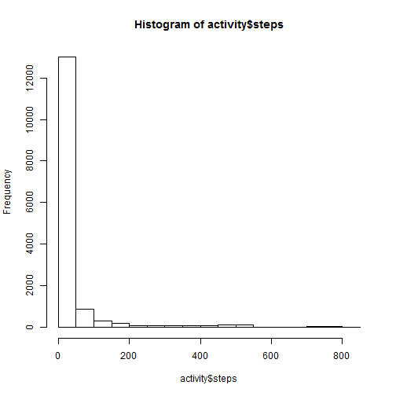
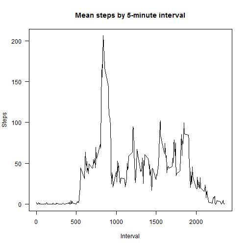
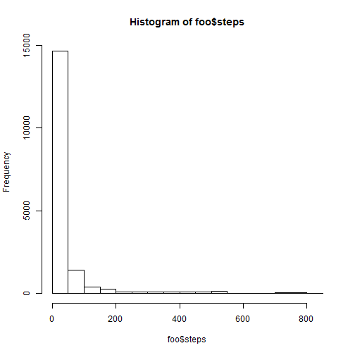
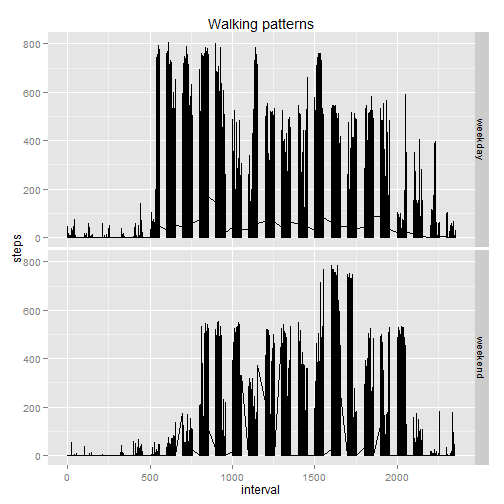

Peer Assessment 1
========================================================

## Loading and preprocessing the data

1. Loading
    
    ```r
    # Unzip to temp file, because there's no need to clog the working directory
    here <- tempdir()
    unzip('repdata-data-activity.zip',exdir=here)
    
    # Read into data frame and see what's in it
    activity <- read.csv(paste(here,'activity.csv',sep='/'))
    ```
2. Preprocessing
    
    ```r
    head(activity)
    ```
    
    ```
    ##   steps       date interval
    ## 1    NA 2012-10-01        0
    ## 2    NA 2012-10-01        5
    ## 3    NA 2012-10-01       10
    ## 4    NA 2012-10-01       15
    ## 5    NA 2012-10-01       20
    ## 6    NA 2012-10-01       25
    ```
    
    ```r
    str(activity)
    ```
    
    ```
    ## 'data.frame':	17568 obs. of  3 variables:
    ##  $ steps   : int  NA NA NA NA NA NA NA NA NA NA ...
    ##  $ date    : Factor w/ 61 levels "2012-10-01","2012-10-02",..: 1 1 1 1 1 1 1 1 1 1 ...
    ##  $ interval: int  0 5 10 15 20 25 30 35 40 45 ...
    ```
    
    ```r
    # Make date strings into proper dates
    activity$date <- as.Date(activity$date)
    str(activity)
    ```
    
    ```
    ## 'data.frame':	17568 obs. of  3 variables:
    ##  $ steps   : int  NA NA NA NA NA NA NA NA NA NA ...
    ##  $ date    : Date, format: "2012-10-01" "2012-10-01" ...
    ##  $ interval: int  0 5 10 15 20 25 30 35 40 45 ...
    ```

## What is mean total number of steps taken per day?

1. Histogram of the number of steps:

     
    
2. Mean and median:

Ignoring missing values, the mean number of steps taken per day is 37.38 and the median is 0. Is 0 right? There are 17568 observations. Of these, 11014 record 0 steps. That's 62.69%, so it looks right.

## What is the average daily activity pattern?

1. Plot of average steps by 5-minute intervals:

     
    
2. The interval containing the maximum number of steps is 835.

## Imputing missing values

1. The total number of rows with missing values in the data set is 2304. There are three columns, and in theory any of them could have missing values. The total number of cases where only the number of steps is missing is 2304. I can check that there are no missing values in any of the other two variables: date (0 missing values) or interval (0 missing values).

2. Filling in missing values: I will just use means by interval.

3. Creating a new data set with filled in values:

    
    ```r
    # Bring in means by 5-minute interval
    foo <- merge(activity,ms,by=c('interval'))
    
    # Swap means for missings
    foo$steps <- foo$steps.x
    foo$steps[is.na(foo$steps.x)] <- foo$steps.y[is.na(foo$steps.x)]
    
    # Tidy up:  
    foo <- subset(foo,select=-c(steps.x,steps.y)) # drop unneeded columns
    foo <- foo[order(foo$date),]                  # sort by date
    foo <- foo[,c(3,2,1)]                         # restore original column order
    
    # New mean and median number of steps
    meanSteps <- mean(foo$steps)
    medianSteps <- median(foo$steps)
    zeroSteps <- sum(foo$steps==0)
    ```

4. With imputed missing values, the mean number of steps taken per day is 37.38 and the median is 0. Is 0 right? There are 17568 observations. Of these, 11166 record 0 steps. That's 63.56%, so it looks right. It appears that imputing missing values has a negligible effect on the mean and no effect at all on the median, because zero values amount to more than half of all observations. The new histogram is below:

     

## Are there differences in activity patterns between weekdays and weekends?

1. Tag weekend data:

    
    ```r
    # Tag weekends and check
    foo$weekday <- weekdays(as.Date(foo$date))
    foo$weekend <- foo$weekday %in% c('Sunday','Saturday')
    table(foo$weekday,foo$weekend)
    ```
    
    ```
    ##            
    ##             FALSE TRUE
    ##   Friday     2592    0
    ##   Monday     2592    0
    ##   Saturday      0 2304
    ##   Sunday        0 2304
    ##   Thursday   2592    0
    ##   Tuesday    2592    0
    ##   Wednesday  2592    0
    ```
2. Plot it:
    
     

It appears that on weekends people wake up later, because the average number of steps picks up later in the day than it does on weekdays.
